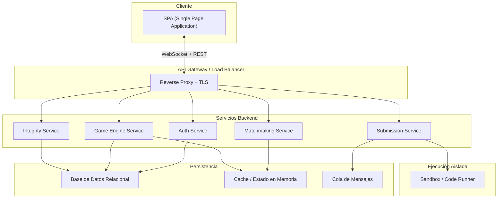
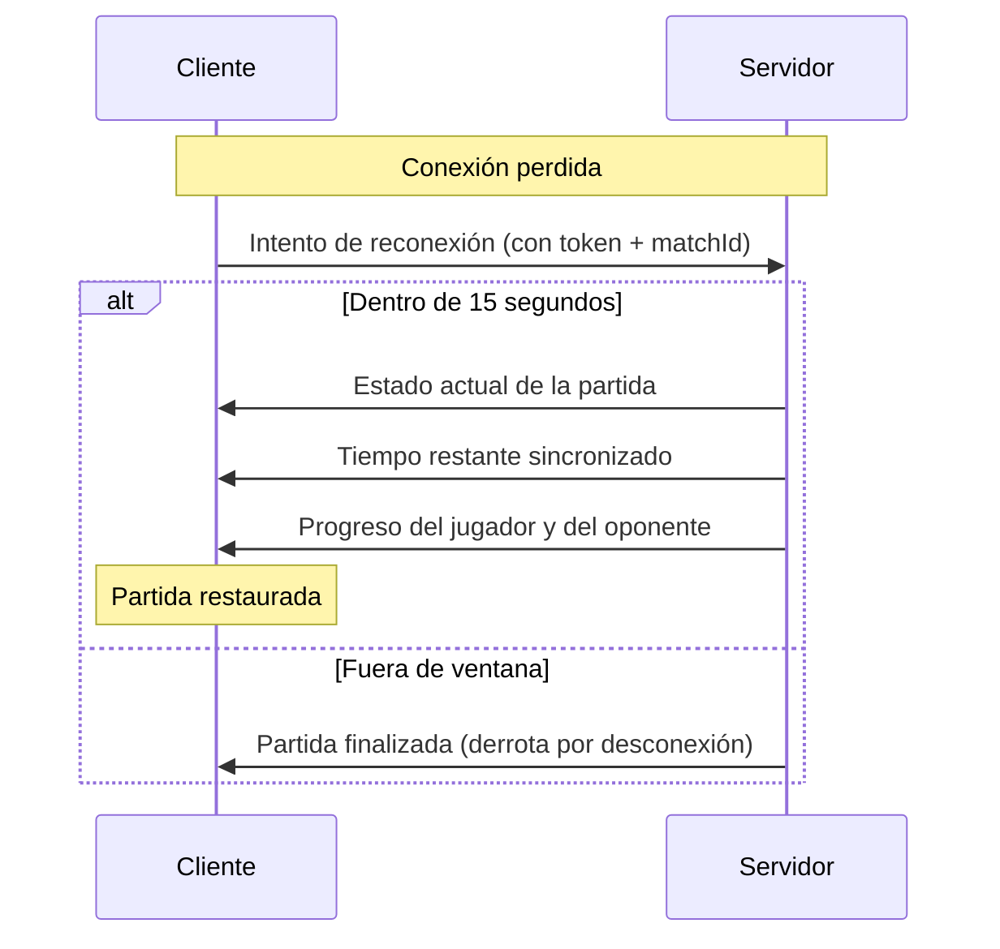
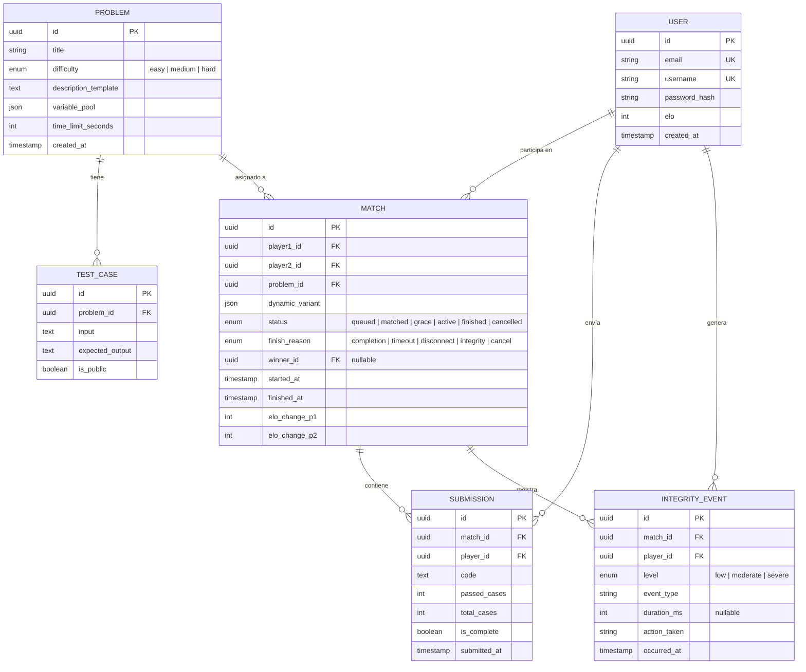
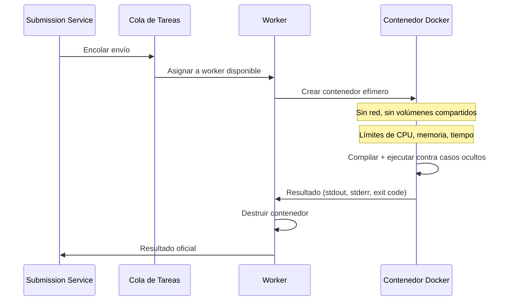
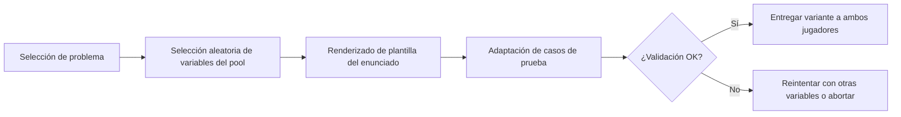
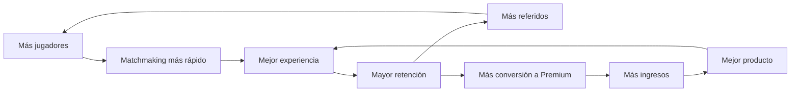
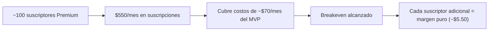
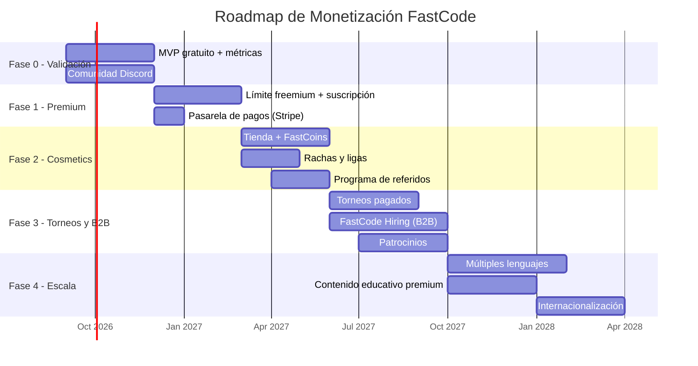

# Propuestas de Arquitectura y Stack Tecnológico — FastCode MVP

**Versión:** 1.0  
**Fecha:** 2026-08-28  
**Basado en:** PRD FastCode MVP v2.0  

---

## Índice

1. [Resumen de Restricciones Técnicas del PRD](#restricciones)
2. [Propuesta de Arquitectura General](#arquitectura)
3. [Propuesta A — Stack Recomendado (Node.js + React)](#propuesta-a)
4. [Propuesta B — Stack Alternativo (Go + React)](#propuesta-b)
5. [Propuesta C — Stack Python (Django/FastAPI + React)](#propuesta-c)
6. [Comunicación en Tiempo Real](#tiempo-real)
7. [Persistencia y Bases de Datos](#persistencia)
8. [Ejecución Aislada de Código (Sandbox)](#sandbox)
9. [Generación de Variantes Dinámicas](#variantes)
10. [Observabilidad y Telemetría](#observabilidad)
11. [Despliegue e Infraestructura](#despliegue)
12. [Comparativa de Propuestas](#comparativa)
13. [Recomendación Final](#recomendacion)
14. [Modelo de Negocio y Monetización](#modelo-negocio)
15. [Estrategia de Crecimiento y Captación](#estrategia-crecimiento)
16. [Proyección Financiera del MVP](#proyeccion-financiera)
17. [Roadmap de Monetización por Fases](#roadmap-monetizacion)

---

<a id="restricciones"></a>
## 1. Resumen de Restricciones Técnicas del PRD

Antes de proponer cualquier stack, es importante tener presentes los requisitos no funcionales que condicionan las decisiones técnicas:

| Requisito | Valor objetivo |
|-----------|---------------|
| Latencia p95 de eventos en tiempo real | < 150 ms |
| Evaluación de envíos (p95) | < 5 segundos |
| Capacidad simultánea | 100 partidas / 200 usuarios |
| Reconexión | Ventana de 15 segundos con sincronización de estado |
| Ejecución de código | Aislada, sin acceso a red ni datos de otros usuarios |
| Accesibilidad | WCAG 2.1 AA |
| Responsive | Pantallas pequeñas y grandes |

---

<a id="arquitectura"></a>
## 2. Propuesta de Arquitectura General

Independientemente del stack elegido, la arquitectura se organiza en estas capas:



### Servicios Principales

| Servicio | Responsabilidad |
|----------|----------------|
| **Auth Service** | Registro, login, sesiones, tokens JWT |
| **Matchmaking Service** | Cola de espera, búsqueda por ventanas de Elo, emparejamiento |
| **Game Engine Service** | Ciclo de vida de la partida, estados, temporizadores, periodo de gracia, reconexión |
| **Submission Service** | Recepción de envíos, delegación al sandbox, resultado oficial |
| **Integrity Service** | Recepción de telemetría del cliente, clasificación de evidencias, sanciones |

> [!IMPORTANT]
> En el MVP se recomienda un **monolito modular** con separación lógica por módulos, no microservicios independientes. Esto reduce la complejidad operativa sin sacrificar la organización interna. La separación en servicios desplegables por separado puede hacerse después del piloto.

---

<a id="propuesta-a"></a>
## 3. Propuesta A — Stack Recomendado (Node.js + React)

### Frontend

| Decisión | Elección | Justificación |
|----------|----------|---------------|
| Framework | **React 19 + TypeScript** | Ecosistema maduro, amplia comunidad, excelente para SPAs interactivas |
| Build tool | **Vite** | Bundling rápido, HMR instantáneo, configuración mínima |
| Estado global | **Zustand** | Ligero, simple, ideal para estado de partida en tiempo real |
| Editor de código | **Monaco Editor** (VS Code) | Soporte completo de lenguajes, personalizable, accesible |
| Estilos | **Tailwind CSS 4** | Utility-first, responsive por defecto, consistente |
| WebSocket client | **Socket.IO Client** | Reconexión automática, fallbacks, rooms |
| Routing | **React Router v7** | Estándar de la industria para SPAs React |
| Testing | **Vitest + Testing Library** | Rápido, compatible con Vite, buenas prácticas de testing |

### Backend

| Decisión | Elección | Justificación |
|----------|----------|---------------|
| Runtime | **Node.js 22 LTS** | Event loop ideal para WebSockets y alta concurrencia de I/O |
| Framework | **NestJS + TypeScript** | Modular, inyección de dependencias, estructura escalable tipo monolito modular |
| WebSocket server | **Socket.IO** | Rooms para partidas, reconexión nativa, namespaces |
| Autenticación | **JWT (access + refresh tokens)** | Stateless, compatible con WebSockets |
| Hashing | **bcrypt o Argon2** | Estándar para contraseñas |
| Validación | **class-validator + class-transformer** | Decoradores integrados con NestJS |
| ORM | **Prisma** | Type-safe, migraciones, buen DX con TypeScript |
| Testing | **Jest + Supertest** | Integrado con NestJS |

### Ventajas de esta propuesta
- **TypeScript end-to-end**: tipos compartidos entre frontend y backend
- **Gran ecosistema**: librerías maduras para cada necesidad
- **Event loop de Node.js**: excelente para WebSockets y operaciones de I/O concurrentes
- **NestJS**: estructura empresarial que facilita escalar de monolito a servicios

### Desventajas
- Node.js no es ideal para computación intensiva (mitigado: la ejecución de código va al sandbox)
- Socket.IO añade overhead sobre WebSockets puros (aceptable para 200 usuarios concurrentes)

---

<a id="propuesta-b"></a>
## 4. Propuesta B — Stack Alternativo (Go + React)

### Frontend

Idéntico a la Propuesta A (React 19 + TypeScript + Vite + Monaco + Tailwind).

### Backend

| Decisión | Elección | Justificación |
|----------|----------|---------------|
| Lenguaje | **Go 1.23** | Alto rendimiento, goroutines para concurrencia, binarios compilados |
| Framework | **Fiber o Echo** | Ligeros, rápidos, buen ecosistema de middleware |
| WebSocket server | **gorilla/websocket o nhooyr/websocket** | WebSockets nativos con goroutines por conexión |
| Autenticación | **JWT con golang-jwt** | Estándar, buen rendimiento |
| ORM | **GORM o sqlc** | GORM para productividad, sqlc para rendimiento y type-safety |
| Testing | **testing + testify** | Estándar de Go |

### Ventajas
- **Rendimiento superior**: goroutines manejan miles de conexiones WebSocket con mínima memoria
- **Binarios compilados**: despliegue simple, sin runtime externo
- **Baja latencia**: ideal para cumplir el p95 < 150ms incluso bajo carga

### Desventajas
- **Dos lenguajes**: TypeScript en frontend, Go en backend (no se comparten tipos)
- **Ecosistema más pequeño**: menos librerías "listas para usar" comparado con Node.js
- **Curva de aprendizaje**: Go requiere conocimiento específico del equipo
- **Desarrollo más lento**: Go es más verboso que TypeScript para lógica de negocio

---

<a id="propuesta-c"></a>
## 5. Propuesta C — Stack Python (FastAPI + React)

### Frontend

Idéntico a la Propuesta A (React 19 + TypeScript + Vite + Monaco + Tailwind).

### Backend

| Decisión | Elección | Justificación |
|----------|----------|---------------|
| Lenguaje | **Python 3.12+** | Popular, fácil de reclutar, excelente para prototipado rápido |
| Framework | **FastAPI** | Async nativo, auto-documentación OpenAPI, validación con Pydantic |
| WebSocket server | **FastAPI WebSockets (Starlette)** | Integrado, async nativo |
| Autenticación | **python-jose + passlib** | JWT estándar con hashing seguro |
| ORM | **SQLAlchemy 2.0 + Alembic** | Async, maduro, migraciones robustas |
| Task queue | **Celery + Redis** | Para orquestar evaluaciones de código asíncronas |
| Testing | **pytest + httpx** | Estándar de la industria en Python |

### Ventajas
- **Velocidad de desarrollo**: Python permite iterar muy rápido en el MVP
- **FastAPI**: rendimiento async competitivo, documentación automática
- **Fácil contratación**: Python es uno de los lenguajes más populares

### Desventajas
- **Rendimiento en WebSockets**: Python async es más lento que Node.js y significativamente más lento que Go para conexiones concurrentes
- **GIL**: aunque FastAPI es async, el GIL limita la concurrencia CPU-bound
- **Dos lenguajes**: no comparte tipos con el frontend TypeScript
- **Mayor consumo de memoria** por conexión WebSocket comparado con Go y Node.js

---

<a id="tiempo-real"></a>
## 6. Comunicación en Tiempo Real

### Protocolo: WebSockets

La comunicación bidireccional en tiempo real es esencial para:
- Progreso del oponente en vivo (RF4.5)
- Cambios de estado de la partida (RF4.1)
- Alertas de actividad (RF4.6)
- Reconexión y sincronización (RNF3)

### Diseño de Canales/Rooms

```
match:{matchId}           → Canal de la partida (ambos jugadores)
match:{matchId}:player:{userId} → Canal privado del jugador
matchmaking:queue         → Canal de la cola de matchmaking
user:{userId}             → Canal personal (notificaciones)
```

### Eventos Principales

| Evento | Dirección | Descripción |
|--------|-----------|-------------|
| `match:found` | Server → Client | Emparejamiento encontrado |
| `match:state_change` | Server → Client | Cambio de fase (gracia → activa → finalizada) |
| `match:timer_sync` | Server → Client | Sincronización de temporizador |
| `opponent:progress` | Server → Client | Progreso agregado del oponente |
| `submission:result` | Server → Client | Resultado de un envío oficial |
| `integrity:warning` | Server → Client | Advertencia de integridad |
| `client:submit` | Client → Server | Envío de solución |
| `client:integrity_event` | Client → Server | Evento de telemetría del cliente |
| `client:reconnect` | Client → Server | Solicitud de reconexión |

### Estrategia de Reconexión



---

<a id="persistencia"></a>
## 7. Persistencia y Bases de Datos

### Base de Datos Principal: PostgreSQL

| Justificación |
|---------------|
| Relacional, ACID, excelente para datos estructurados (usuarios, partidas, envíos) |
| Soporte nativo de JSON para almacenar variantes y metadatos flexibles |
| Extensiones como `pgcrypto` para funciones de seguridad |
| Escalable verticalmente para las necesidades del MVP |

### Cache y Estado en Tiempo Real: Redis

| Uso | Justificación |
|-----|---------------|
| Estado de partidas activas | Acceso rápido O(1), TTL automático |
| Cola de matchmaking | Sorted Sets con Elo como score, operaciones atómicas |
| Sesiones y tokens de reconexión | Expiración automática (15s para reconexión) |
| Rate limiting | Contadores con expiración para RNF2.4 |
| Pub/Sub | Comunicación entre instancias del servidor (si hay varias) |

### Esquema Conceptual de Entidades



---

<a id="sandbox"></a>
## 8. Ejecución Aislada de Código (Sandbox)

Esta es una de las decisiones más críticas del proyecto. El código del usuario debe ejecutarse de forma segura, aislada y con límites estrictos.

### Opción 1: Contenedores efímeros con Docker (Recomendada para MVP)



| Aspecto | Configuración |
|---------|---------------|
| Red | `--network=none` |
| Filesystem | Solo lectura excepto /tmp |
| CPU | Limitado por `--cpus` |
| Memoria | Limitado por `--memory` |
| Tiempo | Timeout controlado por el worker |
| Procesos | Limitados por `--pids-limit` |
| Usuario | Non-root dentro del contenedor |

### Opción 2: Plataforma como servicio (Judge0, Piston)

| Plataforma | Descripción |
|------------|-------------|
| **Judge0** | API open-source de ejecución de código, auto-hospedable, soporta 60+ lenguajes |
| **Piston** | Motor de ejecución ligero, fácil de desplegar, API REST |

**Ventaja**: Menos trabajo de infraestructura propio.  
**Desventaja**: Dependencia externa, menos control sobre el aislamiento y los tiempos.

### Opción 3: Sandbox nativo (gVisor / nsjail)

| Herramienta | Descripción |
|-------------|-------------|
| **gVisor (runsc)** | Runtime de contenedores de Google que intercepta syscalls |
| **nsjail** | Sandbox ligero basado en namespaces de Linux |

**Ventaja**: Mayor aislamiento que Docker estándar.  
**Desventaja**: Mayor complejidad de configuración, requiere Linux.

> [!TIP]
> **Para el MVP se recomienda la Opción 1 (Docker efímero)** con un pool pre-calentado de contenedores. Esto equilibra seguridad, simplicidad y rendimiento. Si se necesita mayor aislamiento, se puede migrar el runtime a gVisor sin cambiar la arquitectura.

### Lenguaje Soportado para el MVP

Se recomienda comenzar con **un solo lenguaje** para simplificar el sandbox, la evaluación y las variantes dinámicas:

| Candidato | Ventajas | Desventajas |
|-----------|----------|-------------|
| **JavaScript (Node.js)** | Muy popular, ejecución rápida, mismo ecosistema que el backend | Tipado débil puede dificultar problemas algorítmicos |
| **Python** | Extremadamente popular, sintaxis clara, ideal para algoritmos | Más lento en ejecución, requiere ajustar timeouts |
| **Java** | Tipado fuerte, popular en competitiva | Tiempo de arranque de JVM, mayor consumo de memoria |
| **C++** | Rendimiento máximo, estándar en programación competitiva | Mayor complejidad para principiantes, errores de memoria |

> [!IMPORTANT]
> **Recomendación: Python como lenguaje inicial.** Es el más accesible, el más popular en la comunidad de programación y algoritmia, y la lentitud de ejecución se mitiga ajustando los timeouts. Permite que el MVP llegue a la mayor audiencia posible.

---

<a id="variantes"></a>
## 9. Generación de Variantes Dinámicas

### Mecanismo Propuesto

Cada problema almacena una **plantilla parametrizable** y un **pool de variables**:

```
Plantilla del enunciado:
  "Escribe una función llamada {{function_name}} que reciba
   un arreglo de enteros llamado {{param_name}} y retorne..."

Pool de variables:
  function_name: ["resolver", "calcular", "procesar", "encontrar", "computar"]
  param_name: ["datos", "numeros", "valores", "elementos", "lista"]
```

### Flujo de Generación



### Validación de Variantes

Antes de entregar una variante, el sistema debe verificar:

1. La plantilla se renderiza sin errores
2. Los casos públicos son coherentes con la variante
3. Los casos ocultos producen resultados esperados con una solución de referencia
4. Los nombres de funciones/variables son identificadores válidos en el lenguaje elegido

---

<a id="observabilidad"></a>
## 10. Observabilidad y Telemetría

### Stack de Observabilidad

| Capa | Herramienta | Propósito |
|------|-------------|-----------|
| Logs | **Pino** (Node.js) o **zerolog** (Go) | Logs estructurados en JSON |
| Métricas | **Prometheus + Grafana** | Dashboards de latencia, partidas, errores |
| Trazas | **OpenTelemetry** | Trazas distribuidas entre servicios |
| Alertas | **Grafana Alerting** | Alertas por umbrales de latencia o errores |

### Métricas Clave a Instrumentar (según PRD §7)

| Métrica | Tipo | Etiquetas |
|---------|------|-----------|
| `matchmaking_duration_seconds` | Histograma | `result: matched\|timeout` |
| `match_completion_rate` | Contador | `finish_reason` |
| `submission_evaluation_duration_seconds` | Histograma | `language, difficulty` |
| `websocket_event_latency_seconds` | Histograma | `event_type` |
| `integrity_events_total` | Contador | `level, event_type` |
| `active_matches_total` | Gauge | — |
| `active_websocket_connections` | Gauge | — |

---

<a id="despliegue"></a>
## 11. Despliegue e Infraestructura

### Opción 1: VPS / Servidor Dedicado (Recomendada para MVP)

| Componente | Sugerencia |
|------------|------------|
| Proveedor | **DigitalOcean, Hetzner o AWS Lightsail** |
| Servidor | 4 vCPU, 8 GB RAM (suficiente para 100 partidas) |
| Reverse Proxy | **Nginx o Caddy** (TLS automático con Caddy) |
| Contenedores | **Docker Compose** para orquestar servicios |
| CI/CD | **GitHub Actions** → build → test → deploy via SSH |
| Base de datos | PostgreSQL en el mismo servidor o servicio managed |
| Redis | En el mismo servidor |

**Costo estimado**: $20-50 USD/mes para el MVP.

### Opción 2: Cloud Managed (AWS / GCP)

| Componente | Servicio |
|------------|---------|
| Cómputo | **AWS ECS Fargate** o **GCP Cloud Run** |
| Base de datos | **AWS RDS PostgreSQL** o **GCP Cloud SQL** |
| Cache | **AWS ElastiCache Redis** o **GCP Memorystore** |
| Load Balancer | **AWS ALB** (soporte WebSocket) |
| CI/CD | **GitHub Actions + AWS CDK/Terraform** |

**Costo estimado**: $80-150 USD/mes para el MVP.

> [!TIP]
> **Para el MVP se recomienda la Opción 1 (VPS con Docker Compose).** Es significativamente más barata, más simple de operar y suficiente para la escala del MVP (100 partidas / 200 usuarios). La migración a cloud managed se puede hacer cuando se necesite escalar.

### Estructura de Docker Compose

```
services:
  app:        # Backend (NestJS / Go / FastAPI)
  frontend:   # Nginx sirviendo el build de React
  postgres:   # Base de datos
  redis:      # Cache y estado en tiempo real
  sandbox:    # Pool de contenedores para ejecución de código
  prometheus: # Métricas (opcional en MVP inicial)
  grafana:    # Dashboards (opcional en MVP inicial)
```

---

<a id="comparativa"></a>
## 12. Comparativa de Propuestas

| Criterio | Propuesta A (Node.js) | Propuesta B (Go) | Propuesta C (Python) |
|----------|:---------------------:|:-----------------:|:--------------------:|
| Velocidad de desarrollo | ⭐⭐⭐⭐⭐ | ⭐⭐⭐ | ⭐⭐⭐⭐ |
| Rendimiento WebSockets | ⭐⭐⭐⭐ | ⭐⭐⭐⭐⭐ | ⭐⭐⭐ |
| Ecosistema y librerías | ⭐⭐⭐⭐⭐ | ⭐⭐⭐ | ⭐⭐⭐⭐ |
| TypeScript end-to-end | ✅ | ❌ | ❌ |
| Facilidad de contratación | ⭐⭐⭐⭐⭐ | ⭐⭐⭐ | ⭐⭐⭐⭐⭐ |
| Rendimiento computacional | ⭐⭐⭐ | ⭐⭐⭐⭐⭐ | ⭐⭐ |
| Complejidad de despliegue | ⭐⭐⭐⭐ | ⭐⭐⭐⭐⭐ | ⭐⭐⭐⭐ |
| Madurez para monolito modular | ⭐⭐⭐⭐⭐ (NestJS) | ⭐⭐⭐ | ⭐⭐⭐⭐ (FastAPI) |
| Idoneidad para el MVP | ⭐⭐⭐⭐⭐ | ⭐⭐⭐⭐ | ⭐⭐⭐⭐ |

---

<a id="recomendacion"></a>
## 13. Recomendación Final

### Stack Recomendado para el MVP

| Capa | Tecnología |
|------|------------|
| **Frontend** | React 19 + TypeScript + Vite + Tailwind CSS |
| **Editor** | Monaco Editor |
| **Backend** | NestJS + TypeScript (Node.js 22 LTS) |
| **Tiempo real** | Socket.IO (WebSockets) |
| **Base de datos** | PostgreSQL 16 |
| **Cache / Estado** | Redis 7 |
| **ORM** | Prisma |
| **Sandbox** | Docker efímero (contenedores sin red) |
| **Lenguaje del duelo** | Python 3.12 |
| **Autenticación** | JWT (access + refresh tokens) + bcrypt |
| **Despliegue** | VPS + Docker Compose + Caddy |
| **CI/CD** | GitHub Actions |
| **Observabilidad** | Pino (logs) + Prometheus + Grafana |

### Justificación

1. **TypeScript end-to-end** acelera el desarrollo y reduce errores entre frontend y backend.
2. **NestJS** ofrece estructura de monolito modular con inyección de dependencias, ideal para crecer de MVP a producto.
3. **Socket.IO** resuelve reconexión, rooms y fallbacks con mínima configuración.
4. **PostgreSQL + Redis** cubren persistencia ACID y estado en tiempo real respectivamente.
5. **Docker efímero** proporciona aislamiento suficiente para el MVP sin complejidad excesiva.
6. **Python como lenguaje de duelo** maximiza la audiencia potencial.
7. **VPS + Docker Compose** minimiza costos y complejidad operativa para el piloto.

> [!NOTE]
> Esta propuesta es un punto de partida. Cada decisión debe validarse con las capacidades del equipo de desarrollo, el presupuesto disponible y los resultados del piloto. Las tecnologías marcadas como "opcionales" pueden incorporarse progresivamente.

---

<a id="modelo-negocio"></a>
## 14. Modelo de Negocio y Monetización

La plataforma tiene potencial de generar ingresos por múltiples vías. A continuación se presentan las estrategias organizadas por viabilidad y momento de implementación.

### 14.1 Modelo Freemium con Suscripción Premium

Este es el **motor principal de ingresos** recomendado. El acceso gratuito atrae volumen de usuarios y la suscripción Premium convierte a los más comprometidos.

| Característica | Gratis | Premium |
|---------------|--------|---------|
| Duelos 1v1 al día | 3 | Ilimitados |
| Lenguajes disponibles | 1 (Python) | Todos los disponibles |
| Historial de partidas | Últimas 5 | Completo + análisis |
| Estadísticas de rendimiento | Básicas (Elo, W/L) | Avanzadas (tiempo promedio, tasa por dificultad, gráficos de progreso) |
| Revisión de código post-partida | ❌ | ✅ Ver solución del oponente al finalizar |
| Temas del editor | Predeterminado | Catálogo completo de temas |
| Insignias exclusivas | ❌ | ✅ Marco premium en perfil |
| Cola de matchmaking | Estándar | Prioridad (menor tiempo de espera) |
| Acceso anticipado a problemas nuevos | ❌ | ✅ 1 semana antes |

**Precio sugerido:**

| Plan | Precio | Ahorro |
|------|--------|--------|
| Mensual | $5.99 USD/mes | — |
| Trimestral | $14.99 USD/trimestre | ~17% |
| Anual | $49.99 USD/año | ~30% |

> [!TIP]
> El límite de 3 duelos diarios gratuitos es clave: suficiente para enganchar al usuario, pero genera frustración positiva que impulsa la conversión. Plataformas como Chess.com y Duolingo usan esta misma mecánica.

### 14.2 Torneos de Entrada Pagada (Post-MVP)

Los torneos competitivos son una fuente de ingresos directa y un generador de engagement masivo.

| Tipo de Torneo | Entrada | Premio | Comisión FastCode |
|----------------|---------|--------|-------------------|
| **Torneo Diario** | $1 - $2 USD | Pool distribuido entre Top 3 | 15-20% del pool |
| **Torneo Semanal** | $5 USD | Pool mayor + insignia exclusiva | 15-20% del pool |
| **Torneo Patrocinado** | Gratis o $1 USD | Premios del patrocinador (licencias, hardware, vouchers) | Patrocinador paga fee fijo |
| **Torneo Corporativo** | Pagado por empresa | Reclutamiento/employer branding | $500-2000 por evento |

**Modelo de comisión:**
```
Pool total = Entradas recaudadas
Comisión FastCode = Pool × 0.15 a 0.20
Premio distribuido = Pool - Comisión
```

**Ejemplo concreto:** Torneo semanal con 200 participantes × $5 = $1,000 pool → $150-200 para FastCode, $800-850 en premios.

### 14.3 FastCode for Teams / B2B (Evaluación Técnica para Empresas)

Esta es la vía de **mayor margen de ganancia** a mediano plazo. Las empresas de tecnología gastan miles de dólares en herramientas de evaluación técnica (HackerRank, Codility, CodeSignal).

#### Producto B2B: FastCode Hiring

| Funcionalidad | Descripción |
|---------------|-------------|
| **Salas privadas de evaluación** | La empresa crea duelos controlados entre candidatos |
| **Banco de problemas corporativo** | Problemas personalizados subidos por la empresa |
| **Dashboard de resultados** | Rendimiento comparativo de candidatos con métricas detalladas |
| **Reportes exportables** | PDF/CSV con Elo, tiempo de resolución, calidad de código |
| **Integración ATS** | Webhook o API para conectar con Greenhouse, Lever, etc. |
| **Evaluación en vivo** | El reclutador observa el duelo en tiempo real (modo espectador) |

**Pricing B2B:**

| Plan | Precio | Incluye |
|------|--------|---------|
| Starter | $199 USD/mes | 50 evaluaciones/mes, 1 sala |
| Professional | $499 USD/mes | 200 evaluaciones/mes, 5 salas, problemas custom |
| Enterprise | $999+ USD/mes | Ilimitadas, API, integraciones, soporte dedicado |

> [!IMPORTANT]
> El producto B2B reutiliza el 80% de la infraestructura existente (editor, sandbox, evaluación, Elo). El costo marginal de añadir esta vertical es bajo comparado con el ingreso potencial.

### 14.4 Marketplace de Cosmetics y Personalización

Modelo probado en gaming (Fortnite, League of Legends) aplicado a coding.

| Item | Precio | Descripción |
|------|--------|-------------|
| **Temas del editor** | $1.99 - $3.99 | Temas visuales para Monaco Editor (Cyberpunk, Retro, Dracula Pro, etc.) |
| **Marcos de perfil** | $0.99 - $2.99 | Bordes animados o temáticos para el avatar |
| **Títulos** | $0.99 | Títulos debajo del username ("El Veloz", "Depurador", "Arquitecto") |
| **Efectos de victoria** | $1.99 - $4.99 | Animación especial al ganar un duelo |
| **Paquetes temáticos** | $7.99 - $14.99 | Bundle de tema + marco + título + efecto |

**Moneda virtual (FastCoins):**
```
100 FastCoins = $0.99 USD
500 FastCoins = $3.99 USD (20% bonus)
1200 FastCoins = $7.99 USD (33% bonus)
```

Los usuarios también pueden ganar FastCoins limitadas jugando (incentivo de retención).

### 14.5 Patrocinios y Partnerships

| Tipo | Modelo | Ejemplo |
|------|--------|---------|
| **Problema patrocinado** | Una empresa patrocina un problema temático | "Resuelve el challenge de Spotify: optimiza una playlist" |
| **Torneo patrocinado** | La marca financia el prize pool | "Copa GitHub: $500 en premios" |
| **Branding en arena** | Logo del sponsor visible durante el duelo | Banner discreto en la interfaz |
| **Contenido co-creado** | Problemas diseñados con la empresa | AWS patrocina problemas de cloud computing |

**Pricing orientativo:**

| Patrocinio | Precio estimado |
|------------|----------------|
| Problema patrocinado (1 mes) | $500 - $1,500 |
| Torneo patrocinado | $1,000 - $5,000 |
| Branding mensual en arena | $2,000 - $10,000 (según MAU) |

### 14.6 Programa de Afiliados y Referidos

| Mecánica | Recompensa |
|----------|------------|
| **Referido registra y juega 5 duelos** | Ambos reciben 3 días de Premium gratis |
| **Referido se suscribe a Premium** | El referidor recibe 15% de comisión del primer mes |
| **Creador de contenido (YouTube, Twitch)** | Código de descuento 20% + comisión recurrente del 10% |
| **Influencer de programación** | Acuerdo personalizado + acceso anticipado a features |

### 14.7 API Pública de Evaluación de Código (Post-MVP)

Monetizar la infraestructura del sandbox como servicio independiente.

| Plan API | Precio | Ejecuciones/mes |
|----------|--------|-----------------|
| Free | $0 | 100 |
| Developer | $19/mes | 5,000 |
| Business | $79/mes | 25,000 |
| Scale | $199/mes | 100,000 |

**Casos de uso:**
- Plataformas educativas que necesitan ejecutar código de estudiantes
- Blogs técnicos con snippets interactivos
- Herramientas internas de empresas para code challenges

### 14.8 Contenido Educativo Premium

| Producto | Precio | Descripción |
|----------|--------|-------------|
| **Rutas de aprendizaje** | $9.99 - $29.99 (único) | Packs de problemas progresivos por tema (grafos, DP, strings) |
| **Análisis de soluciones** | Incluido en Premium | Explicación paso a paso de la solución óptima |
| **Preparación de entrevistas** | $19.99/mes | Problemas estilo FAANG con evaluación y feedback |
| **Certificación FastCode** | $29.99 (único) | Examen timed que otorga un certificado verificable de nivel |

---

<a id="estrategia-crecimiento"></a>
## 15. Estrategia de Crecimiento y Captación

### 15.1 Flywheel de Crecimiento



### 15.2 Canales de Adquisición

| Canal | Estrategia | Costo estimado |
|-------|-----------|----------------|
| **Comunidades dev** | Posts en Reddit (r/learnprogramming, r/cscareerquestions), Dev.to, Hashnode | Gratis (orgánico) |
| **YouTube / Twitch** | Creators de programación hacen duelos en vivo | Producto gratis + comisión de afiliado |
| **Universidades** | Programa gratuito para clubes de programación y clases de algoritmos | Gratis (acuerdo institucional) |
| **Hackathons** | Presencia como sponsor o herramienta complementaria | $200-500 por evento |
| **SEO** | Blog con soluciones de problemas, tutoriales de algoritmos | Tiempo de creación de contenido |
| **Product Hunt** | Lanzamiento en Product Hunt para visibilidad inicial | Gratis |
| **Twitter/X tech** | Threads de problemas interesantes, highlights de duelos épicos | Gratis (orgánico) |
| **Discord** | Servidor propio con comunidad, rankings, eventos semanales | Gratis |

### 15.3 Retención y Engagement

| Mecánica | Descripción | Impacto esperado |
|----------|-------------|------------------|
| **Racha diaria** | Bonus de FastCoins por jugar N días consecutivos | +25% retención D7 |
| **Liga semanal** | Bronce → Plata → Oro → Diamante según partidas jugadas esa semana | +30% partidas/semana |
| **Desafío del día** | Un problema destacado diario con leaderboard | Tráfico recurrente diario |
| **Temporadas** | Ciclos de 3 meses con reset parcial de liga y recompensas exclusivas | Reengagement trimestral |
| **Logros** | "Primera victoria", "10 rachas", "Elo 1500" con badges compartibles | Motivación a largo plazo |

---

<a id="proyeccion-financiera"></a>
## 16. Proyección Financiera del MVP

### 16.1 Supuestos Base

| Variable | Valor |
|----------|-------|
| Usuarios registrados (6 meses post-lanzamiento) | 5,000 |
| Usuarios activos mensuales (MAU) | 1,500 (30%) |
| Tasa de conversión a Premium | 5% de MAU |
| Precio promedio de suscripción | $5.50 USD/mes |
| Compra promedio de cosmetics (usuarios que compran) | $3.00 USD/mes |
| % de MAU que compra cosmetics | 3% |

### 16.2 Proyección Mensual (Mes 6)

| Fuente de Ingreso | Cálculo | Ingreso Mensual |
|-------------------|---------|----------------:|
| **Suscripciones Premium** | 75 suscriptores × $5.50 | $412.50 |
| **Cosmetics** | 45 compradores × $3.00 | $135.00 |
| **Torneos** (si se implementa) | 2 torneos × $100 comisión | $200.00 |
| **Total estimado mes 6** | | **$747.50** |

### 16.3 Proyección de Escalamiento (Mes 12-24)

| Escenario | MAU | Premium (5%) | Suscripciones | Cosmetics | Torneos | B2B | **Total/mes** |
|-----------|-----|-------------|---------------|-----------|---------|-----|--------------|
| **Conservador (mes 12)** | 5,000 | 250 | $1,375 | $450 | $400 | $0 | **$2,225** |
| **Moderado (mes 18)** | 15,000 | 750 | $4,125 | $1,350 | $1,200 | $499 | **$7,174** |
| **Optimista (mes 24)** | 50,000 | 2,500 | $13,750 | $4,500 | $4,000 | $2,997 | **$25,247** |

### 16.4 Costos Operativos Estimados

| Concepto | MVP (mes 1-6) | Escalado (mes 12+) |
|----------|--------------|-------------------|
| Servidor / VPS | $30 - $50/mes | $100 - $300/mes |
| Dominio + TLS | $15/año | $15/año |
| Servicios terceros (email, analytics) | $0 - $20/mes | $50 - $100/mes |
| Pasarela de pagos (Stripe: 2.9% + $0.30) | Variable | Variable |
| **Total costos fijos** | **~$50 - $70/mes** | **~$150 - $400/mes** |

> [!NOTE]
> Con el escenario conservador del mes 12, FastCode ya podría cubrir sus costos operativos y generar un margen. El punto de equilibrio estimado se alcanza con ~100 suscriptores Premium activos (~$550/mes de ingresos por suscripciones vs ~$70/mes de costos).

### 16.5 Punto de Equilibrio



---

<a id="roadmap-monetizacion"></a>
## 17. Roadmap de Monetización por Fases

### Fase 0 — MVP Gratuito (Meses 1-3)

| Acción | Objetivo |
|--------|----------|
| Lanzar la plataforma 100% gratuita | Validar la hipótesis del producto |
| Sin límites de duelos | Maximizar engagement y datos |
| Medir retención D1, D7, D30 | Establecer línea base |
| Medir partidas completadas vs abandonadas | Validar experiencia de juego |
| Recoger feedback cualitativo | Entender qué valoran los usuarios |
| Construir comunidad en Discord | Base de early adopters |

> [!IMPORTANT]
> No monetizar durante esta fase. El objetivo es puramente validar que los usuarios disfrutan la experiencia y vuelven a jugar. Monetizar demasiado pronto mata el crecimiento.

### Fase 1 — Introducción de Premium (Meses 3-6)

| Acción | Objetivo |
|--------|----------|
| Introducir el límite de 3 duelos/día para usuarios gratuitos | Crear fricción positiva |
| Lanzar suscripción Premium (mensual y anual) | Primera fuente de ingresos |
| Ofrecer 7 días de trial Premium a todos los usuarios existentes | Convertir early adopters |
| Implementar estadísticas avanzadas exclusivas para Premium | Justificar el valor |
| Integrar pasarela de pagos (Stripe) | Infraestructura de cobro |

### Fase 2 — Cosmetics y Engagement (Meses 6-9)

| Acción | Objetivo |
|--------|----------|
| Lanzar tienda de temas de editor y marcos de perfil | Segunda fuente de ingresos |
| Introducir FastCoins (ganables + comprables) | Moneda virtual del ecosistema |
| Implementar sistema de rachas y ligas semanales | Aumentar retención |
| Lanzar programa de referidos | Crecimiento orgánico |
| Abrir primer torneo gratuito | Testear formato competitivo |

### Fase 3 — Torneos y B2B (Meses 9-15)

| Acción | Objetivo |
|--------|----------|
| Lanzar torneos de entrada pagada | Tercera fuente de ingresos |
| Desarrollar MVP de FastCode Hiring (B2B) | Fuente de alto margen |
| Buscar primeros patrocinadores de problemas/torneos | Ingresos por partnerships |
| Implementar API pública de ejecución (beta) | Cuarta fuente de ingresos |
| Lanzar temporadas competitivas | Reengagement cíclico |

### Fase 4 — Escalamiento (Meses 15+)

| Acción | Objetivo |
|--------|----------|
| Expandir producto B2B con integraciones ATS | Escalar ingreso corporativo |
| Lanzar contenido educativo premium y certificaciones | Quinta fuente de ingresos |
| Soportar múltiples lenguajes (JavaScript, Java, C++) | Ampliar mercado total |
| Buscar inversión o revenue-based financing si los unit economics lo justifican | Acelerar crecimiento |
| Internacionalización (español, inglés, portugués) | Nuevos mercados |

### Resumen Visual del Roadmap



---

> [!CAUTION]
> Las proyecciones financieras son estimaciones basadas en benchmarks de la industria (tasas de conversión del 3-7% para productos freemium, ~2-5% de compra de cosmetics). Los números reales dependerán de la calidad del producto, la ejecución del go-to-market y las condiciones del mercado. Se recomienda revisar estas proyecciones mensualmente con datos reales una vez lanzado el MVP.

